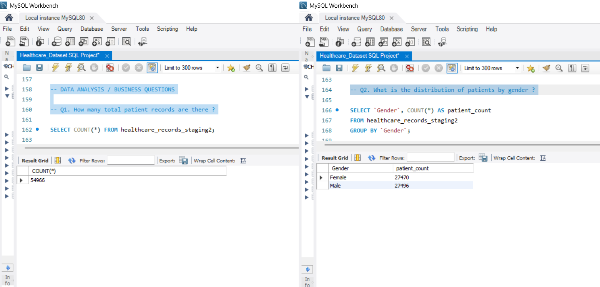
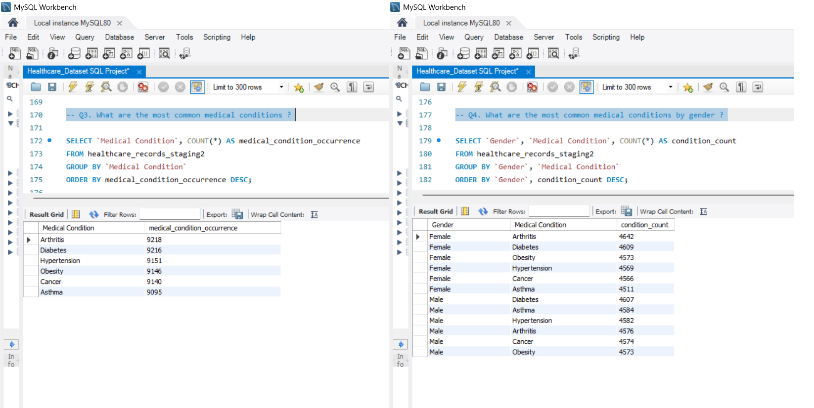
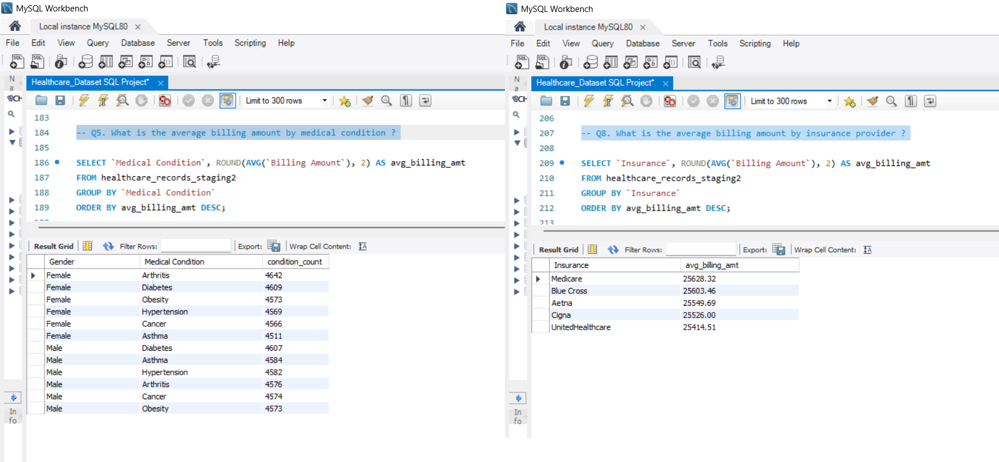
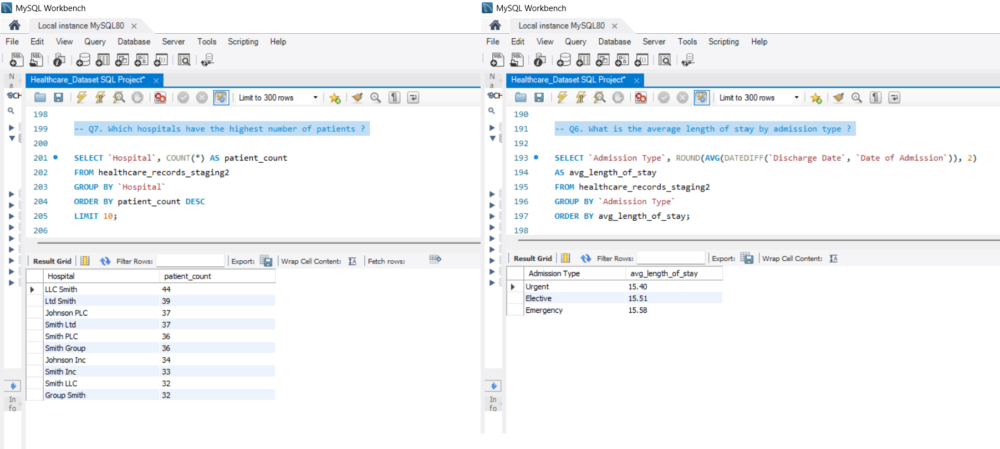
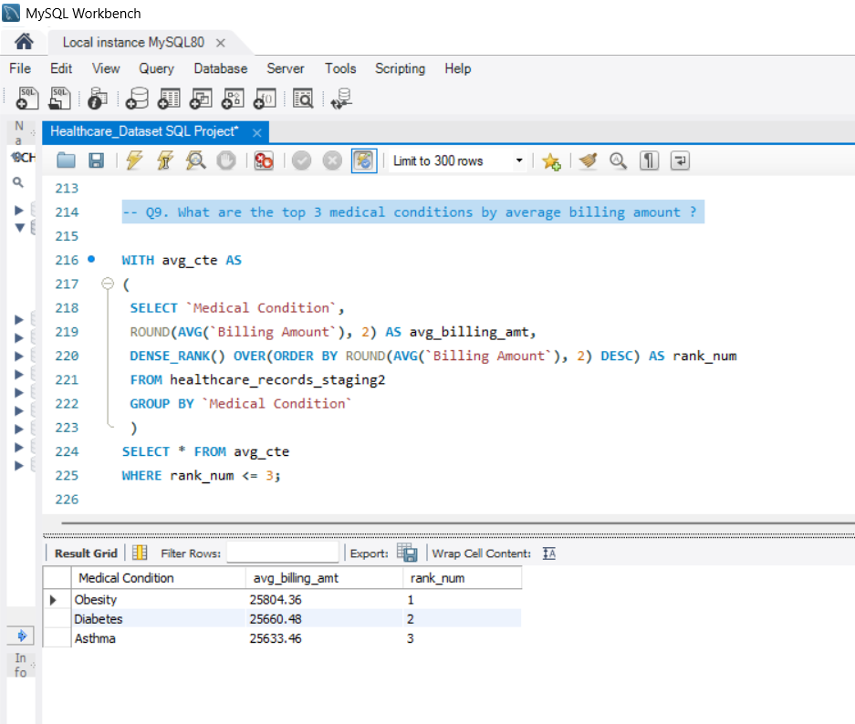

# Healthcare Dataset — SQL Data Cleaning & Analysis Project

## Overview

This project takes a raw healthcare dataset through a complete SQL workflow, starting with importing and checking the data and then cleaning, standardizing, removing duplicates, and analyzing it.

## Dataset

Source: Healthcare Dataset - Kaggle (prasad22)

Size: 55,500 raw records, 15 columns

Columns: Name, Age, Gender, Blood Type, Medical Condition, Date of Admission, Doctor, Hospital, Insurance, Billing Amount, Room Number, Admission Type, Discharge Date, Medication, Test Results

## Tools Used

MySQL 8.0 / MySQL Workbench

## SQL Techniques Used

- Bulk data import (LOAD DATA INFILE)

- Window functions (ROW_NUMBER(), DENSE_RANK())

- Common Table Expressions (CTEs)

- Date functions (DATEDIFF())

- Aggregate functions (COUNT(), AVG(), ROUND())

- WHERE, GROUP BY, ORDER BY for filtering, grouping and sorting

## Project Structure

The full script ([Healthcare_Dataset SQL Project.sql](Healthcare_Dataset%20SQL%20Project.sql)) is organized into two clearly separated phases:

### Part 1 — Data Preparation and Cleaning

| Step | Description |
|---|---|
| 1 | Schema and raw table creation |
| 2 | Load raw CSV data into healthcare_records |
| 3 | Import validation/QA — row count check, warning review, spot checks |
| 4 | Create staging table |
| 5 | Populate staging table from raw data |
| 6 | Validate staging table population |
| 7 | Convert date columns from text to proper DATE type |
| 8 | Explore categorical columns for data quality issues |
| 9 | Identify and remove duplicate records |
| 10 | Check for missing/blank patient names |

### Part 2 — Data Analysis / Business Questions

| Question | SQL Concepts Used |
|---|---|
| Q1 How many total patient records are there? | COUNT() |
| Q2 What is the distribution of patients by gender? | GROUP BY, COUNT() |
| Q3 What are the most common medical conditions? | GROUP BY, COUNT(), ORDER BY |
| Q4 What are the most common medical conditions by gender? | GROUP BY (multi-column) |
| Q5 What is the average billing amount by medical condition? | AVG(), GROUP BY |
| Q6 What is the average length of stay by admission type? | DATEDIFF(), AVG() |
| Q7 Which hospitals have the highest number of patients? | GROUP BY, ORDER BY, LIMIT |
| Q8 What is the average billing amount by insurance provider? | AVG(), GROUP BY |
| Q9 What are the top 3 medical conditions by average billing amount? | CTE + DENSE_RANK() |

## Data Cleaning Highlights

Deduplication: Identified 534 exact duplicate records using ROW_NUMBER() partitioned across all 15 columns, then removed them - reducing the working dataset from 55,500 to 54,966 unique records.

Date standardization: Converted Date of Admission and Discharge Date from text to native DATE type after confirming consistent YYYY-MM-DD formatting across all values.

Data quality validation: Verified every categorical column (Medical Condition, Admission Type, Test Results, Blood Type, Gender, Insurance) for inconsistent casing and unexpected values with the help of SELECT DISTINCT

Missing data check: Confirmed zero missing or blank patient names, the one field essential to every downstream record.

Import validation: Reviewed MySQL warnings from the initial load (decimal precision truncation on Billing Amount) and confirmed it was an acceptable, expected rounding to standard currency precision.

## Key Finding

Across nearly every dimension analyzed - medical condition, admission type, insurance provider, and gender - patient counts and average billing amounts show remarkably little variation. In a real-world healthcare dataset, conditions like Cancer would be expected to show meaningfully higher billing than Hypertension or Arthritis, and admissions would rarely be this evenly split. This uniformity strongly suggests the dataset was synthetically generated with randomized values, rather than reflecting genuine real-world healthcare cost and utilization patterns.

## Design Decisions

No surrogate key added. The source data has no natural unique identifier (e.g., Patient ID), and none of the analysis questions require row-level referencing, so a surrogate key was intentionally left out.

Raw table preserved. healthcare_records is never modified after import - it serves as an untouched backup. All cleaning happens on a staging copy, following standard staging-table practice.

## How to Run

1. Download or clone this repository.

2. Open [Healthcare_Dataset SQL Project.sql](Healthcare_Dataset%20SQL%20Project.sql) in MySQL Workbench.

3. Make sure "[healthcare_dataset.csv](healthcare_dataset.csv)" is available in MySQL's permitted import directory.

4. If required, update the CSV file path in the "LOAD DATA INFILE" statement to match your local setup.

5. Run the SQL script from top to bottom.

The script creates the raw and staging tables, imports and cleans the data, removes duplicates, performs data-quality checks, and runs the nine business questions.

## File

[Healthcare_Dataset SQL Project.sql](Healthcare_Dataset%20SQL%20Project.sql) - the complete, commented script covering both cleaning and analysis phases.

[healthcare_dataset.csv](healthcare_dataset.csv) - the source dataset.

## Query Results

**Q1 & Q2** - total records, gender distribution

**Q3 & Q4** - most common conditions, overall and by gender

**Q5 & Q8** - average billing by condition, and by insurance provider

**Q6 & Q7** - average length of stay by admission type, top hospitals by patient count

**Q9** - top 3 conditions by average billing amount

